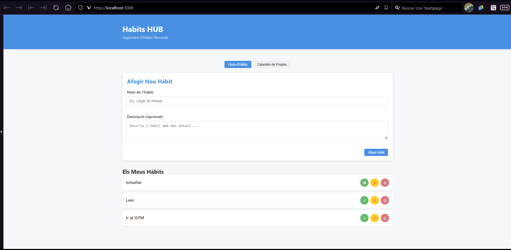
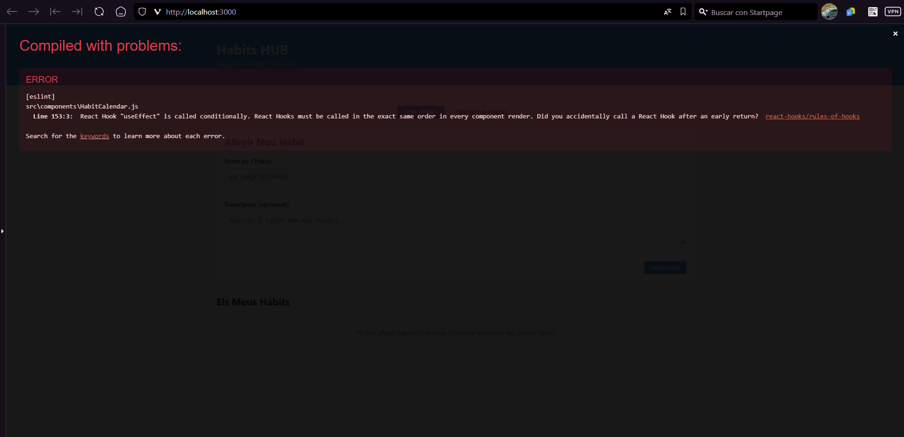
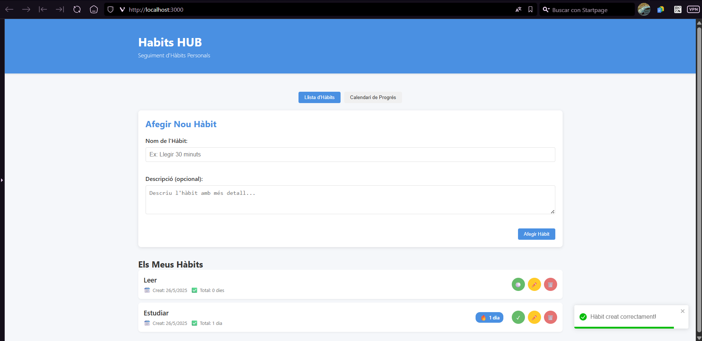

# Readme publicado en [https://github.com/Gorkah/Habits-HUB](https://github.com/Gorkah/Habits-HUB)


# 🧠 Proyecto Web de Seguimiento de Hábitos tipo GitHub Contributions

## Prompts utilizado para guiar a la IA:
---
## Primer PROMPT:

**"CON CLAUDE SONNET 3.7 (THINKING): Créame una web que cumpla el documento de requisitos. Y me gustaría que tuviera como un historial de los hábitos estilo GitHub contributions."**

## 🎯 Objetivo

Crear una aplicación web que permita registrar y visualizar hábitos diarios de forma atractiva y funcional, con especial énfasis en:

- Visualización tipo "contribution graph" (como el de GitHub).
- Cumplimiento estricto del documento de requisitos funcionales y no funcionales.
- Interfaz limpia, responsiva y fácil de usar.


## 📸 Vista previa

### 🌱 Página principal con resumen diario



---

### 📊 Visualización de hábitos tipo GitHub

.png)

---

## SEGUNDO PROMPT:

**"CON CLAUDE SONNET 3.7 (THINKING): 
El funcionamiento es correcto. Tambien podrias mejorar el diseño visualmente haciendolo mas responsive y tambien añadir los dias que llevas en racha."**

## 🎯 Objetivo

El primer prompt dió una app que cumplia todos los requisitos pero aun era mejorable. El resultado final al ejecutar tras los cambios del segundo prompt surgió el siguiente error:


---

## TERCER PROMPT:

**"CON CLAUDE SONNET 3.7 (THINKING): 

Me ha aparecido este error al compilar: Compiled with problems:
×
ERROR
[eslint] 
src\components\HabitCalendar.js
  Line 153:3:  React Hook "useEffect" is called conditionally. React Hooks must be called in the exact same order in every component render. Did you accidentally call a React Hook after an early return?  react-hooks/rules-of-hooks

Search for the keywords to learn more about each error."**

## 🎯 Objetivo

El segundo prompt arrojó un error, que impedia su ejecución asi que arreglamos el error:

## 📸 Vista previa

### 🌱 Página principal con resumen diario



---

### 📊 Visualización de hábitos tipo GitHub

.png)

---

## 🤖 Reflexió sobre l’ús de la IA

L’ús de la intel·ligència artificial, en aquest projecte, ha estat una eina molt útil durant tot el procés de desenvolupament. S’ha fet servir per:

- Generar fragments de codi basats en les necessitats especificades en les històries d’usuari.
- Resoldre dubtes puntuals de sintaxi i bones pràctiques.
- Proposar estructures lògiques per a la interfície i el comportament del sistema.

Aquest suport ha permès treballar de manera més eficient i dedicar més temps a l’anàlisi funcional que no pas a problemes tècnics concrets.

Tot i això, també s’ha après que cal revisar totes les aportacions generades per la IA. No sempre són totalment precises o adaptades al context específic, i poden requerir ajustaments per assegurar-ne la qualitat i adequació.

---

# Habits HUB

Una aplicació web per al seguiment d'hàbits personals, creada amb React.

## Característiques

- **Definir hàbits personals**: Crea i personalitza els teus propis hàbits per fer seguiment.
- **Marcar hàbits com completats**: Registra el teu progrés diari.
- **Calendari de compliment**: Visualitza el teu progrés en un format de calendari estil GitHub.
- **Gestió d'hàbits**: Edita o elimina hàbits fàcilment.
- **Persistència de dades**: Les teves dades es guarden localment al teu navegador.

## Històries d'usuari implementades

- **US-01**: Com a usuari, puc definir hàbits personals per portar el control de les meves rutines.
- **US-02**: Com a usuari, puc marcar hàbits com completats per saber si he seguit els meus objectius.
- **US-03**: Com a usuari, puc veure un calendari de compliment per visualitzar el meu progrés.
- **US-04**: Com a usuari, puc eliminar hàbits antics per mantenir només els rellevants.

## Requisits previs

- Node.js (versió 14 o superior)
- npm (normalment ve amb Node.js)

## Instal·lació

1. Clona aquest repositori o descarrega'l
2. Obre una terminal a la carpeta del projecte
3. Instal·la les dependències:

```
npm install
```

4. Inicia l'aplicació en mode desenvolupament:

```
npm start
```

5. Obre [http://localhost:3000](http://localhost:3000) al teu navegador per veure l'aplicació.

## Ús

### Afegir un nou hàbit

1. A la vista de "Llista d'Hàbits", omple el formulari amb el nom i la descripció opcional de l'hàbit.
2. Fes clic a "Afegir Hàbit".

### Marcar un hàbit com completat

1. A la llista d'hàbits, fes clic al botó circular al costat de l'hàbit per marcar-lo com a completat per avui.
2. Per desfer l'acció, torna a fer clic al mateix botó.

### Veure el calendari de progrés

1. Fes clic al botó "Calendari de Progrés" a la part superior.
2. Selecciona l'hàbit que vols visualitzar al menú desplegable.
3. El calendari mostrarà els dies en què has completat aquest hàbit.

### Editar o eliminar un hàbit

- Per editar: Fes clic al botó d'edició (✏️) al costat de l'hàbit.
- Per eliminar: Fes clic al botó d'eliminació (🗑️) i confirma.

## Tecnologies utilitzades

- React
- localStorage per persistència de dades
- react-calendar-heatmap per visualització de calendari
- react-toastify per notificacions
- date-fns per manipulació de dates
- UUID per generació d'identificadors únics

## Llicència

Aquest projecte està llicenciat sota la Llicència MIT.
